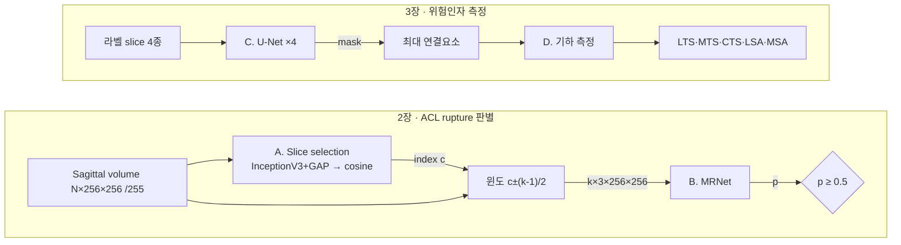
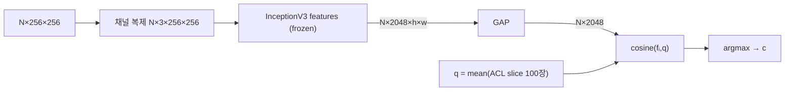
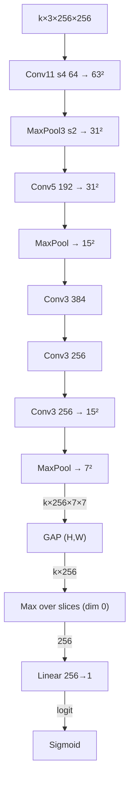
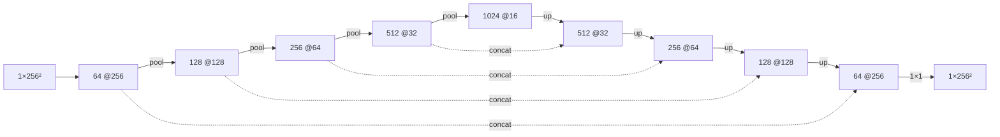
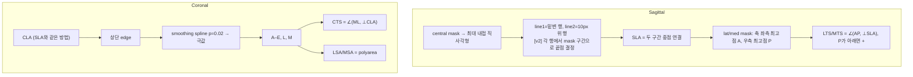
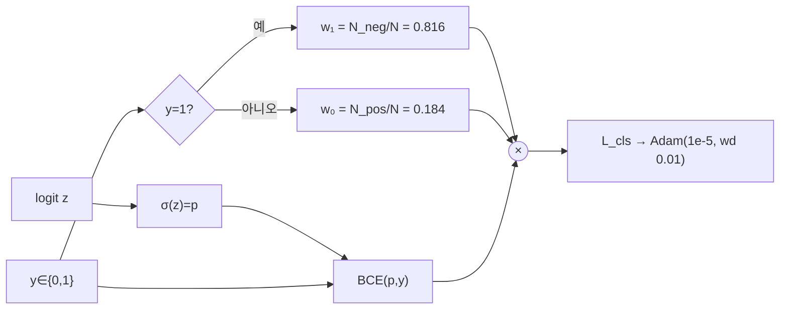
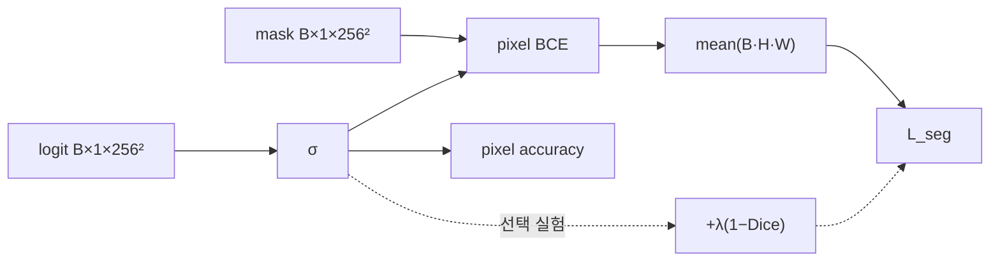

# HANDOFF — ACL Cascaded CNN 논문 재현 (TDD)

| 항목 | 내용 |
|---|---|
| 실행 모델 | **Claude Sonnet** (이 문서만 보고 바로 구현을 시작할 수 있도록 작성) |
| 원문 | 신재우, *CNN-based analysis of ACL injuries and related anatomical risk factors*, 홍익대 기계공학과 석사논문, 2020.02 (지도 오유근) · `thesis/000000024681_20260915135439.pdf` · 70쪽 · CC BY-NC-ND 2.0 KR |
| 시각 부록 | Artifact **「ACL Cascaded CNN 구조도」** — https://claude.ai/artifact/SeMkmGrBBo9FN5Ph8neR4b |
| 동봉 데이터 | `ch3_slice_labels.csv` — 논문 Appendix A(3장 Dataset 1·2, 120 exam)의 slice 라벨을 옮긴 파일 |
| 작성일 | 2026-09-15 |
| 버전 | **v2 — 최종 검토 반영본.** v1 초안에서 바뀐 곳은 본문에 `[v2]`로 표시했고, 검토 결과 전체는 §9 리뷰 기록에 있습니다. |

> ⚠️ **주제 확인:** 이 논문은 무릎 **관절염(OA)** 이 아니라 **전방십자인대(ACL) 파열**과 경골(tibia) 형상 위험인자를 다룹니다. 이 문서는 논문 그대로 재현하는 계획이고, OA 과제로 옮기는 방법은 §7에 따로 정리했습니다.

**표기 규칙** — 🟦 논문 명시 · 🟨 근거 기반 추정(원문에 없음) · 🟥 미명시(§5에서 기본값 결정)

---

## 1. 요약 정리 (TL;DR)

**문제.** 무릎 MRI 판독은 오래 걸리고 판독자마다 결과가 다릅니다. 논문은 CNN으로 (1) ACL 파열 판별과 (2) ACL 손상 위험인자(경골 경사 등) 측정을 자동화합니다.

**2장 — Cascaded CNN (파열 판별)**
- **1단계, 학습 없음:** ImageNet으로 사전학습한 InceptionV3에 GAP를 붙여 slice마다 2048차원 벡터를 뽑습니다. 이 벡터와 라벨된 ACL slice 100장의 평균 벡터(query) 사이의 **cosine 유사도**가 가장 큰 slice를 "ACL slice"로 고릅니다. 4개 추출기(PCA/VGG16/ResNet-50/InceptionV3)와 2개 유사도를 비교했고, InceptionV3+cosine의 오차가 0.0008 ± 0.0934로 가장 작았습니다.
- **2단계, 학습함:** ACL slice를 중심으로 **k장**을 잘라 Stanford **MRNet**(slice 간 가중치를 공유하는 AlexNet → GAP → slice 축 max-pool → FC → sigmoid)에 넣습니다.
- **핵심 결과:** k=9에서 **AUC 0.9501**을 얻어 k=1(0.8611)과 whole volume(0.8895)보다 높았습니다. 정확도는 k=11에서 0.89로 가장 높았습니다. k가 13을 넘으면 성능이 다시 떨어집니다. 즉 **"적당히 인접한 slice만 쓰는 편이 전체 volume을 다 쓰는 것보다 낫다"** 는 것이 논문의 주장입니다.
- **학습 설정:** Adam, lr 1e-5, weight decay 0.01, batch 1, 최대 35 epoch, validation loss가 가장 낮은 epoch를 선택합니다.

**3장 — 위험인자 자동 측정**
- slice 종류(coronal central, sagittal medial/central/lateral)마다 **U-Net을 하나씩, 모두 4개** 학습해 경골을 분할합니다. IoU는 0.87~0.96으로 모든 종류에서 Watershed보다 높았습니다.
- 분할 mask에 **규칙 기반 기하 알고리즘**(원래 MATLAB 구현)을 적용해 LTS, MTS, CTS, LSA, MSA를 측정합니다.
- **결과:** 평가 20건 중 sagittal 측정은 3건, coronal 측정은 5건 실패했습니다. 정상군은 LTS와 MTS가 대부분 양수였고, LSA와 MSA에서는 뚜렷한 분포 차이가 보이지 않았습니다.

**논문의 한계 (재현 시 주의할 점)**
1. **손실 함수 식이 원문에 없습니다.** §4에서 근거를 들어 추정했습니다.
2. 최적 k=9는 이 데이터셋에 크게 의존하고, slice 선택이 틀리면 분류가 크게 틀어집니다.
3. 3장 측정의 신뢰성은 임상의 측정과 비교해 검증되지 않았고, 2D 입력 slice 선택에 민감합니다.
4. U-Net 채널 수, padding, 윈도 경계 처리, slice 인덱스 기준(0/1-base)이 적혀 있지 않습니다.
5. "Dataset 1/2"라는 이름이 2장과 3장에서 **서로 다른 집합**을 가리킵니다.
6. `[v2]` **최적 k를 test set 결과로 골랐습니다.** 따라서 k=9의 성능은 낙관적으로 추정된 값입니다. 재현할 때는 k를 validation set으로 고르고 test 결과는 따로 보고합니다(§6 Phase 5).
7. `[v2]` 2장의 slice 선택(Keras로 추정)과 MRNet(PyTorch 공개 코드)은 서로 다른 프레임워크로 구현했을 가능성이 높습니다. 전처리와 하이퍼파라미터의 의미가 프레임워크마다 다를 수 있습니다(§5 #13–#16).

---

## 2. 논문 분석 — 구성요소별 명세와 "테스트 가능한 성질"

TDD로 옮기려면 각 구성요소를 **입력 → 출력 → 반드시 성립해야 하는 성질**로 바꿔야 합니다. 이 표가 §6 테스트 목록의 출처입니다.

| ID | 구성요소 | 입력 → 출력 | 반드시 성립해야 하는 성질 (테스트 대상) | 근거 |
|---|---|---|---|---|
| D1 | 전처리 | uint8 `N×256×256` → float `N×256×256` | 값 범위 [0,1], `x/255` 정확 일치, dtype float32 | 🟦 §2.2.1 |
| D2 | 데이터 분할 | 공식 train 1130 / valid 120 | train 1000(816/184), val 130(106/24), test = 공식 valid 120(66/54) | 🟦 Table 2.1 |
| A1 | 특징 추출기 | `N×3×256×256` → `N×2048` | shape, `eval()` 모드, `requires_grad=False`, 같은 입력이면 같은 출력, `[v2]` **query와 exam에 똑같은 전처리 함수를 적용** | 🟦 Fig 2.3 / 🟥 전처리 |
| A2 | Query 생성 | ACL slice 100장 → `q ∈ ℝ²⁰⁴⁸` | 특징의 평균과 같음, 파일 저장/로드 후에도 동일 | 🟦 §2.2.2.3 |
| A3 | 유사도·선택 | `N×2048`, `q` → index `c` | cosine: 스케일 불변, q 자신이 argmax, 동률이면 가장 작은 index | 🟦 §2.2.2.2 |
| A4 | 선택 오차 | `(gt, ret, N)` → float | `(gt−ret)/(N−1)`, 부호 유지, 범위 [−1,1] | 🟦 §2.2.2.3 |
| W1 | 윈도 추출 | volume, `c`, `k` → `k'×256×256` | k는 홀수, 가운데 slice가 c, 경계에서 clip | 🟦 §2.3.1 / 🟥 경계 |
| B1 | MRNet | `k×3×256×256` → logit `()` | 중간 shape `k×256×7×7`, slice 순서를 바꿔도 출력 불변, `[v2]` **집계가 mean이 아니라 max임을 직접 검증**, 임의의 k에서 동작 | 🟦 §2.2.3 |
| L1 | 분류 손실 | logit, y → scalar | 가중 BCE, `[v2]` **가중치를 샘플 라벨마다 따로 선택**, p=0.5일 때 기댓값 ≈ 0.208 | 🟦 BCE+불균형 보정(Bien 2018) / 🟨 가중치 형태 |
| T1 | 학습 루프 | — | best-val-loss 체크포인트, Adam 하이퍼파라미터 일치, 작은 배치 과적합 가능 | 🟦 §2.3.1 |
| E1 | 분류 평가 | p, y → Acc/Sens/Spec/AUC | threshold 0.5, 손으로 계산한 confusion matrix와 일치 | 🟦 §2.3.2 |
| C1 | U-Net | `B×1×256×256` → `B×1×256×256` | 입출력 해상도 동일, skip concat 채널 수 일치 | 🟦 Fig 3.1 / 🟨 채널 |
| L2 | 분할 손실 | logit, mask → scalar | pixel BCE, 완벽한 예측이면 0에 수렴 | 🟨 §4.2 |
| C2 | 후처리 | mask → mask | 가장 큰 연결요소 하나만 남음, 멱등성 | 🟦 §3.2.2 |
| C3 | IoU | P, G → float | 동일하면 1, 서로 겹치지 않으면 0, 대칭 | 🟦 Table 3.2 |
| G1 | 최대 내접 직사각형 | mask → (r0,c0,r1,c1) | 축 정렬, 내부가 모두 1, 면적 최대 | 🟦 §3.2.3.1 |
| G2 | SLA/CLA | 직사각형 + mask → 축(점, 방향) | line2 = 밑변에서 10px 위. `[v2]` **각 line의 양 끝은 해당 행에서 mask가 차지하는 구간**(직사각형 폭이 아님). 따라서 기울어진 shaft에서는 SLA도 기울어짐 | 🟦 Fig 3.6 / 🟥 선분 끝점 |
| G3 | LTS/MTS | mask, 축 → deg | 축 좌/우 최고점 A/P, P가 orthogonal-SLA 아래면 +, `[v2]` 영상 좌표(행 번호가 아래로 증가) 기준 고정, 회전해도 값이 거의 같음 | 🟦 Fig 3.7 |
| G4 | 상단 edge·landmark | coronal mask → A–E, L, M | smoothing spline(p=0.02), 1차 미분 부호 변화로 극값 탐지 | 🟦 Fig 3.8–3.9 |
| G5 | CTS | L, M, CLA → deg | ∠(ML line, orthogonal-CLA) | 🟦 Fig 3.10 |
| G6 | LSA/MSA | edge, 교점 → pixel² | shoelace 면적, 실패하면 NaN(예외를 던지지 않음) | 🟦 Fig 3.11 |

---

## 3. 아키텍처 모델 상세 구조

> 색상과 표가 포함된 전체 버전은 Artifact 「ACL Cascaded CNN 구조도」에 있습니다. 아래는 구현자가 같은 내용을 바로 볼 수 있도록 옮긴 Mermaid 원본입니다.

### 3.1 전체 파이프라인



### 3.2 A. Slice selection (학습 파라미터 없음)



### 3.3 B. MRNet (torchvision AlexNet, 256×256 입력 기준 shape)



```python
# 참조 구현 골격 (Green 단계 목표)
# [v2] features를 주입할 수 있게 해서, 집계 방식(max) 테스트에 stub을 넣을 수 있도록 함
class MRNet(nn.Module):
    def __init__(self, pretrained: bool = True, features: nn.Module | None = None,
                 feat_dim: int = 256):
        super().__init__()
        if features is None:
            w = models.AlexNet_Weights.IMAGENET1K_V1 if pretrained else None
            features = models.alexnet(weights=w).features
        self.features = features
        self.gap = nn.AdaptiveAvgPool2d(1)
        self.classifier = nn.Linear(feat_dim, 1)

    def forward(self, x):            # x: (1, k, 3, 256, 256)
        x = x.squeeze(0)             # (k, 3, 256, 256)
        x = self.gap(self.features(x)).flatten(1)   # (k, 256)
        x = x.max(dim=0).values      # (256,)
        return self.classifier(x).squeeze(-1)       # logit scalar
```

> `[v2]` Stanford baseline 계열 공개 코드는 224×224로 center crop하고 `(x−58.09)/49.73`로 표준화합니다. 이 경우 feature map은 `6×6`입니다. 논문은 `256×256`과 `/255`만 명시하므로 기본값은 논문을 따르고, 크기 테스트는 두 경우를 모두 검증합니다(§5 #14).

### 3.4 C. U-Net (🟨 원 U-Net 채널 구성 + same padding)



- 블록 = (Conv3×3 → ReLU) × 2. 🟥 BatchNorm 사용 여부가 적혀 있지 않으므로 기본값은 **사용하지 않음**으로 하고 설정으로 켤 수 있게 둡니다.
- 모델 4개(`cor_c`, `sag_m`, `sag_c`, `sag_l`)는 **같은 클래스에 가중치만 다르게** 둡니다.

### 3.5 D. 기하 측정


---

## 4. 손실 함수 (Loss Function)

> **원문에는 손실 함수 식이 없습니다.** 원문에 있는 것은 "validation loss가 가장 낮은 epoch 선택"이라는 문장과 Fig 2.7(MRNet), Fig 3.2(U-Net)의 loss 곡선뿐입니다. 따라서 아래 식은 모두 🟨 추정이며, 코드에서는 `config.loss.*`로 바꿀 수 있어야 합니다.

### 4.1 L_cls — MRNet 클래스 가중 BCE 🟨



$$
L_{cls} = -\,w_y\left[y\log\sigma(z) + (1-y)\log(1-\sigma(z))\right],\qquad
w_1=\tfrac{N_{neg}}{N}=0.816,\; w_0=\tfrac{N_{pos}}{N}=0.184
$$

**추정 근거** `[v2] 검토 후 수정`
1. **손실의 종류(🟦 수준 근거):** 인용한 MRNet 원 논문(Bien et al., 2018, PLOS Med)이 *"binary cross-entropy loss"*를 쓰고, *"the loss for an example was scaled inversely proportionally to the prevalence of that example's class"*라고 적었습니다.
2. **가중치의 형태(🟨):** Stanford baseline 계열 공개 코드(`loader.py`)는 `neg_weight = np.mean(labels)`, `weights = [neg_weight, 1 − neg_weight]`, `F.binary_cross_entropy_with_logits(..., weight=...)`를 씁니다. 이것은 위 식의 w₀=0.184, w₁=0.816과 정확히 같습니다. 이 코드의 optimizer도 `Adam(lr, weight_decay=.01)`로 논문과 같고, best val-loss 체크포인트 방식도 같습니다.
   - ~~v1: "optimizer·lr·weight decay가 원 논문과 같다"~~ → **정정.** 원 논문 본문에는 optimizer가 없습니다. 일치하는 대상은 공개 baseline 코드입니다.
3. **수치 정합성(보조 근거):** p≈0.5일 때 기대 loss는 `2·0.184·0.816·ln2 = 0.2081`이고, Fig 2.7 곡선은 0.20~0.24 부근에서 시작합니다. 다른 공개 구현이 쓰는 `[1, neg/pos]` 가중치라면 같은 조건에서 **1.131**이므로 곡선과 맞지 않습니다.
   - **한계:** 그래프의 첫 점은 초기화 시점이 아니라 1 epoch 학습 후의 값입니다. 따라서 이 근거로 "가중치 없는 BCE(0.693에서 시작)"를 완전히 배제할 수는 없습니다.
4. **구현:** `F.binary_cross_entropy_with_logits(z, y, weight=w[y])`로 하고, 가중치는 반드시 **샘플의 라벨로 골라서** 넘깁니다. 한 공개 구현은 가중치 텐서 전체를 넘기는 버그가 있으므로 테스트로 막습니다(Phase 4).
5. **공개 baseline에만 있는 설정:** `ReduceLROnPlateau(patience=5, factor=0.3)`와 50 epoch. 논문은 35 epoch만 명시하므로 scheduler는 기본값을 **끔**으로 둡니다(§5 #15).

### 4.2 L_seg — U-Net 픽셀 BCE 🟨



$$
L_{seg} = -\frac{1}{HW}\sum_i \left[g_i\log\sigma(s_i) + (1-g_i)\log(1-\sigma(s_i))\right]
\;(+\;\lambda\,(1-\mathrm{Dice}),\ \lambda_{default}=0)
$$

**추정 근거:** Fig 3.2는 loss와 pixel accuracy를 함께 그립니다. augmentation 파라미터 이름(`shear_range`, `zoom_range`)도 Keras `ImageDataGenerator`와 같습니다. 그래서 Keras의 `binary_crossentropy` + `accuracy` 구성으로 추정합니다. 원 U-Net의 경계 가중 맵(w₀=10, σ≈5)은 사용 근거가 없으므로 넣지 않습니다.

> `[v2]` **"weight decay 0.01"의 의미 주의 (U-Net).** Keras 2.x의 `Adam(decay=…)`은 L2 규제가 아니라 **학습률 시간 감쇠** `lr_t = lr / (1 + decay·t)`입니다(Keras 2.2.4 `optimizers.py`). 3장이 Keras로 구현됐다면 논문의 "weight decay 0.01"은 이 감쇠일 가능성이 있습니다. 반대로 2장 MRNet(PyTorch)의 값은 L2가 맞습니다. 그래서 U-Net 쪽은 `unet.decay_mode ∈ {keras_lr_decay, l2}`로 두 방식을 모두 구현하고, 기본값은 `keras_lr_decay`로 둡니다(§5 #16).
>
> 같은 이유로 `shear_range=0.05`는 Keras에서 **각도(도) 단위**라 사실상 효과가 거의 없습니다. `zoom_range=0.05`는 배율 `[0.95, 1.05]`입니다. torchvision으로 옮길 때는 `RandomAffine(degrees=0, shear=0.05, scale=(0.95, 1.05))`로 대응시킵니다.

### 4.3 학습하지 않는 단계
- Slice selection: 손실 없음. 목적은 `c = argmax cos(fᵢ, q)`이고, 평가 지표는 `(I_gt − I_ret)/(N−1)`입니다.
- 기하 측정: 결정적 알고리즘이며 손실 없음.

---

## 5. 미명시 사항 — 결정 기록 (Decision Log)

아래 기본값으로 구현을 시작하고, 결정 하나당 설정 키 하나를 둡니다.

| # | 원문에 없는 것 | 기본값 | 설정 키 |
|---|---|---|---|
| 1 | 손실 함수 | §4 식 | `loss.cls`, `loss.seg`, `loss.dice_lambda=0` |
| 2 | 클래스 가중치 방식 | `w1=N_neg/N, w0=N_pos/N` (train split 기준) | `loss.class_weight="prevalence"` |
| 3 | 윈도가 volume 경계에 걸릴 때 | 범위 밖은 잘라내고 남은 slice만 사용(k' ≤ k) | `window.edge="clip"` (`"pad_edge"` 선택 가능) |
| 4 | 1채널 → 3채널 변환 | 같은 채널을 3번 복제, ImageNet 정규화는 적용하지 않음(원문은 /255만 명시) | `pre.imagenet_norm=false` |
| 5 | train/val 분할 방법 | 공식 train 1130에서 층화 추출, seed 고정(42), 결과 수가 816/184·106/24인지 테스트로 확인 | `data.split_seed` |
| 6 | Slice selection용 100+20 exam | 2장 train에서 층화 없이 무작위 120개 추출, seed 고정 | `select.sample_seed` |
| 7 | Appendix slice index 기준 | **확인 필요.** MATLAB 기준이면 1-base일 가능성이 큼. 기본값은 1-base로 두고 `idx-1`로 변환하며, Phase 1에서 시각 점검 | `labels.index_base=1` |
| 8 | U-Net 채널·padding·BN | 64→1024, same padding, BN 없음 | `unet.base=64`, `unet.bn=false` |
| 9 | 분할 threshold | 0.5 | `seg.threshold` |
| 10 | "smoothing spline 0.02" | MATLAB `csaps`의 p=0.02 → Python `csaps` 패키지 | `geom.spline_p=0.02` |
| 11 | A/P 좌우 방향(Left/Right 무릎) | 영상 좌측을 anterior로 가정하고, `side` 열로 필요 시 좌우 반전 | `geom.flip_by_side=true` |
| 12 | Node A–E 할당 규칙 | 상단 edge에서 왼→오 순서로 극대/극소를 번갈아 배정. 개수가 맞지 않으면 NaN으로 측정 실패 처리(원문도 실패 사례를 보고함) | — |
| 13 `[v2]` | Slice 선택기의 입력 전처리 | "GAP layer 추가"라는 표현이 Keras `include_top=False, pooling='avg'`와 맞으므로 Keras식 `preprocess_input`([−1,1] 스케일)을 기본값으로 둠. PyTorch로 옮길 때는 `inception_v3(transform_input=False)`로 하고 정규화를 직접 적용 | `select.preprocess="keras_inception"` |
| 14 `[v2]` | MRNet 입력 크기와 정규화 | 논문대로 256, `/255`. 선택지로 baseline 방식(224 crop, `(x−58.09)/49.73`) 제공 | `mrnet.input="paper_256"` |
| 15 `[v2]` | LR scheduler | 사용 안 함. 선택지로 baseline의 `ReduceLROnPlateau(5, 0.3)` 제공 | `train.scheduler=null` |
| 16 `[v2]` | U-Net의 "weight decay 0.01" | `keras_lr_decay` (`lr/(1+0.01·t)`), 선택지로 `l2` | `unet.decay_mode` |
| 17 `[v2]` | SLA의 line1/line2 끝점 | 각 행에서 **mask가 연속으로 차지하는 구간**의 양 끝. 근거: Fig 3.6의 SLA가 기울어져 있음. 직사각형 폭을 쓰면 SLA가 항상 수직이 되어 그림과 모순 | `geom.line_extent="mask"` |
| 18 `[v2]` | 좌표계와 "위/아래" | 영상 좌표(행 번호가 아래로 증가). "최고점"은 SLA 방향으로 투영했을 때 가장 위쪽 점 | — |
| 19 `[v2]` | CTS 부호 | 원문 없음(Table 3.3에 음수 있음). 기본값: M(medial)이 L보다 낮으면 + | `geom.cts_sign="medial_low_positive"` |
| 20 `[v2]` | threshold 경계 | `p ≥ 0.5`이면 양성 | `eval.threshold_inclusive=true` |
| 21 `[v2]` | k 선택 프로토콜 | 원문표 재현용으로는 모든 k의 test 결과를 보고. "최적 k"는 **validation AUC로만** 선택 | `eval.k_selection="val"` |

---

## 6. TDD 단계별 구현 및 적용 계획

### 6.0 공통 규칙 (Sonnet 필독)

- **사이클:** 🔴 실패하는 테스트 작성 → 실행해서 실패 확인 → 🟢 최소 구현 → 🔵 리팩터링 → 커밋. 테스트 하나당 커밋 하나를 권장합니다.
- **테스트를 먼저 커밋합니다.** 구현이 테스트를 통과하도록 테스트를 약하게 고치는 것은 금지입니다.
- **테스트 피라미드:** 단위 테스트(합성 텐서·도형, 1초 이내)가 기본입니다. `@pytest.mark.slow`(실제 데이터)와 `@pytest.mark.gpu`는 CI 기본 실행에서 제외합니다.
- **결정성:** 모든 테스트에서 `torch.manual_seed(0)`을 호출하고, 무작위 요소는 인자로 seed를 받습니다. `[v2]` GPU 테스트에서는 `torch.backends.cudnn.deterministic=True`, `benchmark=False`로 설정하고, 재현 수치에는 seed 3개의 평균 ± 표준편차를 보고합니다.
- `[v2]` **이중 루프 TDD:** 바깥 루프에서 논문 표를 재현하는 인수 테스트(`tests/acceptance/`)를 **먼저 `xfail`로 작성**하고, 안쪽 루프에서 단위 테스트로 구현을 채웁니다. 각 Phase가 끝날 때 관련 인수 테스트의 `xfail`을 하나씩 해제합니다.
- `[v2]` **좋은 테스트의 기준:** "그럴듯하지만 틀린 구현"이 실패하는지 확인합니다. 예를 들어 순서 불변성 테스트는 max 대신 mean으로 구현해도 통과하므로, 그 차이를 구분하는 테스트를 따로 둡니다.
- `[v2]` **단계 간 계약:** 단계 사이에서 주고받는 데이터는 `dataclass`로 정의하고(`SelectionResult(c:int, scores:np.ndarray)` 등), shape와 dtype 검증을 계약 테스트로 고정합니다.
- **실데이터가 필요한 테스트**는 `MRNET_ROOT` 환경변수가 없으면 `skip` 처리합니다.
- **사전학습 가중치 다운로드**가 필요한 테스트는 `pretrained=False`로 shape만 검증하고, 가중치를 실제로 받는 검증은 slow 마커를 붙입니다.

```
acl_repro/
├─ pyproject.toml            # pytest, ruff, mypy
├─ configs/default.yaml      # §5 결정 기록의 키
├─ data/ch3_slice_labels.csv # 동봉 파일
├─ src/acl/
│  ├─ data/      preprocess.py  split.py  dataset.py  window.py  labels.py
│  ├─ select/    features.py  query.py  similarity.py  metrics.py
│  ├─ models/    mrnet.py  unet.py
│  ├─ losses.py
│  ├─ train/     loop.py  checkpoint.py
│  ├─ eval/      classification.py  segmentation.py
│  ├─ seg/       postprocess.py
│  └─ geom/      rect.py  axis.py  slope.py  landmarks.py  area.py
└─ tests/        (src 구조를 그대로 따름) + tests/e2e/
```

의존성: `torch torchvision numpy scipy scikit-learn scikit-image csaps pyyaml pandas pytest pytest-cov`

---

### Phase 0 — 뼈대와 CI (0.5일)
| 🔴 테스트 | 🟢 구현 |
|---|---|
| `test_config_loads_all_decision_keys` — `default.yaml`에 §5의 키가 모두 있음 | `acl.config.load()` |
| `test_seed_everything_is_deterministic` — 같은 seed면 `torch.rand` 결과가 같음 | `acl.utils.seed_everything()` |
| `[v2]` `tests/acceptance/test_table_2_2.py`, `test_table_2_3.py`, `test_table_3_2.py`, `test_table_3_3.py` — 모두 `@pytest.mark.xfail(strict=True)` | 인수 기준 뼈대. 허용 오차는 Phase 2·5·6·7에 정의 |

**DoD:** `pytest -m "not slow and not gpu"`가 통과하고 커버리지 리포트가 생성됩니다.

---

### Phase 1 — 데이터 계층 (D1, D2, W1, 라벨)
| 🔴 테스트 | 검증 내용 |
|---|---|
| `test_normalize_range_and_dtype` | uint8 입력(0, 128, 255) → `[0, 0.50196, 1.0]`, dtype float32 |
| `test_to_three_channels` | `N×H×W` → `N×3×H×W`이고 세 채널이 모두 동일 |
| `test_split_counts_match_table_2_1` | 합성 라벨(1130개, 양성 208개)을 분할하면 train 1000 (816/184), val 130 (106/24) |
| `test_split_is_deterministic_and_disjoint` | 같은 seed면 결과가 같고, train과 val의 교집합이 비어 있음 |
| `test_window_center_and_length[k=1..15]` | N=30, c=15 → 길이 k, 가운데 slice가 c |
| `test_window_clips_at_edges` | c=0, k=9 → index 0..4 (길이 5) |
| `test_window_rejects_even_k` | k=4이면 `ValueError` |
| `test_ch3_labels_csv_schema` | 120행, Dataset 1은 100행/Dataset 2는 20행, 인덱스는 양의 정수 |
| `test_ch3_label_index_base_conversion` | `index_base=1`이면 `idx-1`로 변환 |
| `@slow test_mrnet_npy_shape` | 실제 exam `.npy`가 `(s,256,256)` uint8 형식 |
| `@slow test_label_slice_visual_dump` | 결정 #7 확인용: 라벨 slice와 앞뒤 ±1 slice를 PNG로 저장(사람이 눈으로 확인) |

**DoD:** 결정 #7(slice 인덱스 기준)을 시각 점검으로 확정하고 이 문서 §5에 기록합니다.

---

### Phase 2 — Slice selection (A1–A4)
| 🔴 테스트 | 검증 내용 |
|---|---|
| `test_feature_extractor_output_shape` | `pretrained=False`, 입력 `5×3×256×256` → `5×2048` |
| `test_feature_extractor_is_frozen_and_eval` | 모든 파라미터가 `requires_grad == False`이고 `training == False` |
| `test_cosine_scale_invariance` | `cos(a,q) == cos(3a,q)` |
| `test_select_returns_query_match` | 합성 특징 행렬의 7번째 행 = q → 결과 7 |
| `test_select_tie_breaks_to_lowest_index` | 동률이면 가장 작은 index |
| `test_euclidean_variant_available` | `metric="euclidean"`일 때 거리가 가장 작은 행을 선택 |
| `test_query_is_mean_and_roundtrips` | `build_query`가 평균을 반환하고 `.npy`로 저장/로드해도 값이 같음 |
| `test_selection_error_formula` | `(gt=10, ret=12, N=21)` → `-0.1`, `N=1`이면 `ValueError` |
| `[v2]` `test_selection_reports_mae_and_hit_rate` | 오차 `[+0.1, −0.1]` → 부호 있는 평균 0, **MAE 0.1**. 인덱스 오차 `[0, 1, 3]` → `hit@±1 = 2/3`. 부호 있는 평균만으로는 큰 오차가 서로 상쇄되어 보이지 않음 |
| `[v2]` `test_same_preprocess_for_query_and_exam` | `build_query`와 `select`가 같은 전처리 함수 객체를 사용(monkeypatch로 호출 횟수 확인) |
| `[v2]` `test_inception_transform_input_disabled` | PyTorch 경로에서 `model.transform_input is False` |
| `@slow test_selection_error_reproduces_table_2_2` | 20 exam 평가에서 InceptionV3+cosine의 \|mean\| ≤ 0.02, SD ≤ 0.15 (원문 0.0008 ± 0.0934, 표본 차이를 감안한 허용 범위) |

**🔵 리팩터링:** `FeatureExtractor`를 Protocol로 추출해 PCA/VGG16/ResNet-50/InceptionV3를 같은 인터페이스로 교체할 수 있게 합니다(Table 2.2 전체 재현용).

---

### Phase 3 — MRNet 모델 (B1)
| 🔴 테스트 | 검증 내용 |
|---|---|
| `test_alexnet_feature_map_shape[256→7, 224→6]` | `k×3×256×256` → `k×256×7×7`, `[v2]` 224 입력이면 `6×6` |
| `[v2]` `test_mrnet_aggregates_by_max_not_mean` | stub features(각 slice를 상수 feature map `[1]`, `[5]`, `[3]`로 매핑) + `classifier`를 항등으로 고정 → 출력이 **5**(mean이면 3) |
| `test_mrnet_output_is_scalar_logit[k=1,9,30]` | 출력 shape `()`, 값이 유한 |
| `test_mrnet_permutation_invariant` | slice 순서를 섞어도 출력이 같음(`atol=1e-6`) |
| `test_mrnet_shared_weights` | 파라미터 수 = AlexNet features 2,469,696 + 257 = **2,469,953** (k에 무관) |
| `test_mrnet_gradients_flow_to_features` | backward 후 `features[0].weight.grad`가 0이 아님 |
| `test_mrnet_pretrained_flag` | `pretrained=True`일 때 가중치가 ImageNet 값과 같음 (`@slow`) |

---

### Phase 4 — 손실 함수와 학습 루프 (L1, T1)
| 🔴 테스트 | 검증 내용 |
|---|---|
| `test_class_weights_from_prevalence` | (816, 184) → `w1=0.816, w0=0.184` |
| `test_weighted_bce_matches_manual` | 손으로 계산한 값과 `atol=1e-6`에서 일치 |
| `[v2]` `test_weight_is_selected_per_label` | y=1 샘플과 y=0 샘플에 각각 w₁과 w₀가 적용됨. 가중치 텐서 `[w0, w1]` 전체가 broadcast되면 실패하도록 z와 y를 구성 |
| `[v2]` `test_class_weight_variants` | `prevalence_normalized` → (0.184, 0.816), `neg_over_pos` → (1, 4.435) |
| `[v2]` `test_optimizer_is_adam_not_adamw` | `type(opt) is torch.optim.Adam` (L2가 gradient에 더해지는 방식) |
| `test_weighted_bce_uses_logits_stably` | z=±50에서도 NaN/Inf가 없음 |
| `test_weighted_bce_expected_value_at_p_half` `[v2 이름 변경]` | z=0, train 비율(816/184) → 기대 loss **0.2081 ± 1e-3**. `neg_over_pos` 방식이면 **1.131**. 이 테스트는 식의 계산만 검증하며, 논문과의 정합성 판단은 리포트에서 따로 다룸 |
| `test_optimizer_hparams` | Adam, lr 1e-5, weight_decay 0.01 |
| `test_best_checkpoint_selects_min_val_loss` | val loss `[0.3, 0.2, 0.25]` → epoch 1 저장 |
| `test_train_overfits_tiny_batch` | 합성 4샘플을 lr 1e-3으로 50 step 학습하면 loss가 초기값의 절반 이하 |
| `test_max_epochs_respected` | 35를 넘기지 않음 |

---

### Phase 5 — 분류 평가와 k 스윕 (E1)
| 🔴 테스트 | 검증 내용 |
|---|---|
| `test_confusion_metrics_manual` | TP=3, FN=1, TN=4, FP=2 → Acc 0.7, Sens 0.75, Spec 0.667 |
| `test_threshold_is_inclusive_05` | p=0.5 → 양성 |
| `test_auc_perfect_and_random` | 완벽한 분리 → 1.0, 모든 점수가 같으면 → 0.5 |
| `test_k_sweep_runs_all_k` | `k ∈ {1,3,…,15,"whole"}`마다 결과 행 1개 |
| `[v2]` `test_best_k_chosen_on_val_only` | val AUC 최고 k=7, test AUC 최고 k=9인 가짜 결과 → `best_k == 7`. 선택 함수는 test 결과를 인자로 받지 않음 |
| `[v2]` `test_scheduler_off_by_default` | `train.scheduler=null`이면 lr이 epoch 내내 일정 |
| `[v2]` `@slow @gpu test_selection_error_sensitivity` | 선택된 c를 `±d` (d=0,1,2,4)만큼 옮겨 AUC 곡선을 기록(논문 한계 2를 정량화). d=0의 AUC가 가장 높을 것으로 기대하지만, 기대가 틀려도 실패 처리하지 않고 리포트로만 남김 |
| `@slow @gpu test_reproduce_table_2_3_trend` | **정확한 수치가 아니라 경향**을 확인: `AUC(k=9) > AUC(k=1)`, `AUC(k=9) > AUC(whole)`, `AUC(k=9) ≥ 0.90` |

**재현 판정 기준:** AUC가 원문 대비 ±0.03 이내면 "재현"으로, 경향만 맞으면 "부분 재현"으로 기록합니다. `[v2]` test set은 120건(양성 54건)뿐이므로 AUC에 **bootstrap 95% CI**(1,000회)를 붙이고, k 간 차이는 DeLong 검정으로 보고합니다. CI가 겹치면 "차이 불확실"로 표기합니다.

---

### Phase 6 — U-Net 분할 (C1–C3, L2)
| 🔴 테스트 | 검증 내용 |
|---|---|
| `test_unet_preserves_resolution` | `2×1×256×256` → `2×1×256×256` |
| `test_unet_skip_channels` | 각 decoder 입력 채널 수 = up 채널 + skip 채널 |
| `test_seg_bce_zero_for_perfect_logits` | logit이 ±20이고 GT와 일치하면 loss < 1e-6 |
| `test_dice_term_off_by_default` | λ=0이면 순수 BCE와 같음 |
| `test_largest_component_only` | 크기 50과 10인 blob → 50만 남음, 두 번 적용해도 결과가 같음 |
| `test_iou_properties` | 동일하면 1, 겹치지 않으면 0, `IoU(P,G)==IoU(G,P)`, 둘 다 비어 있으면 1로 정의 |
| `test_augmentation_params` | hflip, shear 0.05(도), zoom `[0.95, 1.05]` 설정값 확인, 증강 뒤에도 mask가 이진값 유지 |
| `[v2]` `test_augmentation_same_transform_for_image_and_mask` | image = mask×255인 입력에 증강을 적용한 뒤 `(image>127) == mask` (IoU = 1) |
| `[v2]` `test_keras_lr_decay_schedule` | `decay_mode=keras_lr_decay`이면 step t의 lr = `1e-5/(1+0.01·t)` (t=0, 100에서 확인) |
| `test_four_models_registry` | 키 `cor_c, sag_m, sag_c, sag_l` |
| `test_unet_overfits_single_mask` | 합성 원 mask 1장을 200 step 학습하면 IoU > 0.9 |
| `@slow @gpu test_reproduce_table_3_2` | 4개 모델 모두 IoU ≥ 원문 − 0.05 |

---

### Phase 7 — 기하 측정 (G1–G6), MATLAB → Python 포팅
모든 테스트는 **정답을 해석적으로 알 수 있는 합성 mask**로 작성합니다.

| 🔴 테스트 | 합성 입력 → 기대값 |
|---|---|
| `test_max_inscribed_rect_on_rectangle` | 40×80 직사각형 mask → 그 직사각형 자체 |
| `test_max_inscribed_rect_on_L_shape` | L자 도형 → 면적이 가장 큰 축 정렬 직사각형 (brute-force 결과와 비교) |
| `test_sla_vertical_for_upright_rect` | 똑바로 선 직사각형 → 축 방향 (0, 1) |
| `[v2]` `test_sla_follows_tilted_shaft` | 폭 40, 10px 올라갈 때 가로로 1px 이동하는 평행사변형 shaft → SLA 기울기 = `atan(1/10)` ≈ 5.71° (±1°). **직사각형 폭을 끝점으로 쓰는 구현은 0°가 나와 실패** |
| `[v2]` `test_slope_rotation_invariant` | 합성 경골을 ±5°, ±10° 회전해도 LTS 변화 ≤ 1° (래스터화 오차 허용) |
| `[v2]` `test_highest_point_uses_image_coords` | 행 번호가 작을수록 "높음". y축을 뒤집은 입력을 쓰면 A/P가 바뀜 |
| `test_sla_line2_offset_10px` | line2와 line1의 y 차이 = 10 |
| `test_slope_zero_on_flat_top` | 윗변이 평평한 직사각형 → LTS = 0° |
| `test_slope_sign_convention` | 윗변 뒤쪽(P)이 5px 낮은(행 번호 +5) 사다리꼴(A–P 가로 거리 50) → `+atan(5/50)` = **+5.71°**, 반대 방향이면 −5.71° |
| `[v2]` `test_cts_sign_convention` | medial 쪽 plateau가 3px 낮으면 + (결정 #19), `side`로 좌우 반전해도 부호 유지 |
| `test_flip_by_side` | Left 무릎은 좌우 반전 후 같은 값 |
| `test_top_edge_extraction` | 반원 mask → 상단 edge 점 개수 = 폭, 가장 왼쪽/오른쪽 점 포함 |
| `test_spline_extrema_on_sinusoid` | `y = sin(x)` 두 주기 → 극대 2개, 극소 2개 (위치 오차 ≤ 2px) |
| `test_landmarks_fail_gracefully` | 극값 개수 부족 → `LandmarkError`, 상위 함수는 NaN 반환 |
| `test_cts_known_angle` | L=(0,0), M=(100,−3), CLA 수직 → CTS = `atan(3/100)` |
| `test_polyarea_shoelace` | 단위 정사각형 = 1, 3-4-5 직각삼각형 = 6, 꼭짓점 순서가 반대여도 같음 |
| `@slow test_reproduce_table_3_3_failure_pattern` | Dataset 2 20건에서 측정 실패 수가 원문(3/5)과 비슷하게 ≤ 5/≤ 8, 성공 건의 LTS 부호 분포 보고 |

**주의:** Table 3.3의 subject 번호는 Appendix A의 Dataset 2 순서와 같다고 가정합니다(🟥). 이 가정은 테스트가 아니라 리포트에 명시합니다.

---

### Phase 8 — 통합(E2E)과 리포트
| 🔴 테스트 | 검증 내용 |
|---|---|
| `test_e2e_cascade_on_synthetic_volume` | 가짜 volume(20 slice) → select → window → MRNet → 확률 1개, 예외 없음 |
| `test_e2e_geometry_on_synthetic_tibia` | 합성 경골 mask → 5개 값을 담은 dict, 알려진 각도 ±0.5° |
| `test_report_writes_tables` | `reports/table_2_2.csv`, `table_2_3.csv`, `table_3_2.csv`, `table_3_3.csv` 생성 |

**최종 DoD**
- [ ] 단위 테스트 전체 통과, `src/acl` 커버리지 ≥ 85%
- [ ] Table 2.2·2.3·3.2·3.3 재현 리포트, 원문 수치와 나란히 비교
- [ ] §5 결정 기록 갱신(특히 #7 slice 인덱스 기준)
- [ ] 재현 판정(재현 / 부분 재현 / 불일치)과 원인 메모

### 6.9 일정 가이드

| Phase | 예상 소요 | 선행 조건 |
|---|---|---|
| 0 뼈대 | 0.5일 | — |
| 1 데이터 | 1일 | MRNet 데이터 접근 |
| 2 Slice selection | 1일 | 1 |
| 3 MRNet | 0.5일 | 0 |
| 4 Loss·학습 | 1일 | 3 |
| 5 평가·k 스윕 | 1–2일 (GPU 학습 9회) | 2, 4 |
| 6 U-Net | 1.5일 | 1 |
| 7 기하 | 2일 | 6 (mask만 있으면 합성 데이터로 병렬 진행 가능) |
| 8 통합 | 0.5일 | 전체 |

---

## 7. 무릎 관절염(OA) 과제로 옮길 때 (적용 제안)

이 절은 논문 내용이 아니라 재사용 방법에 대한 제안입니다.

| 논문 요소 | OA 과제에서의 재사용 | 바꿔야 할 것 |
|---|---|---|
| Slice selection (A) | MRI 기반 OA(예: OAI 데이터)라면 "연골이 가장 잘 보이는 slice" 검색에 그대로 사용 가능 | query를 연골/관절강 slice로 새로 구성 |
| MRNet (B) | 다중 slice → 단일 판정 구조를 그대로 사용 | 이진 → **KL grade 0–4 다중 클래스**(CE 또는 ordinal loss), 출력층 256→5 |
| 가중 BCE (L1) | 불균형 보정 아이디어 유지 | 클래스별 가중 CE 또는 grade 간 거리를 반영하는 ordinal 손실 |
| U-Net (C) | 경골·대퇴골·연골 분할에 사용 | 다중 클래스 mask, Dice+CE |
| 기하 측정 (D) | 경사 측정 로직은 그대로, 추가로 **관절강 폭(JSW)** 측정 | 새 측정 항목과 합성 도형 테스트 추가 |
| 입력 모달리티 | Kaggle의 OA 데이터셋은 대부분 **X-ray 단일 2D 영상** | 이 경우 A와 B의 다중 slice 구조는 필요 없고, 단일 영상 CNN + C/D만 재사용 |

TDD 측면에서는 Phase 1의 데이터 계층 테스트와 Phase 4의 손실 테스트만 새로 작성하면 되고, Phase 6·7의 테스트는 대부분 그대로 쓸 수 있습니다.

---

## 8. Sonnet 실행 지시

1. §6.0의 구조로 저장소를 만들고 Phase 0부터 **순서대로** 진행합니다. 각 Phase는 🔴 테스트 커밋 → 🟢 구현 커밋 순서를 지킵니다.
2. 원문에 없는 선택이 필요하면 **§5에 행을 추가**하고, 설정 키로 노출한 뒤 진행합니다. 원문에 있는 값(🟦)은 바꾸지 않습니다.
3. 🟨로 표시된 손실 함수는 `configs/default.yaml`에서 바꿀 수 있어야 하고, 리포트에 "추정"이라고 명시합니다.
4. 실데이터와 GPU가 필요한 테스트는 마커로 분리합니다. 환경이 없으면 skip된 목록을 리포트에 적고 멈추지 않습니다.
5. Phase가 끝날 때마다 `HANDOFF_PROGRESS.md`에 통과한 테스트 수, 남은 결정, 재현 수치를 추가합니다.
6. `[v2]` 구현 전에 §9 리뷰 기록을 읽고, "조치" 열의 항목이 모두 반영됐는지 Phase 0에서 체크리스트로 확인합니다.

---

## 9. 최종 검토 리뷰 기록 (v1 → v2)

**검토 범위:** (1) 아키텍처·손실 함수가 원문과 인용 문헌에서 올바르게 도출됐는지, (2) TDD 설계가 잘못된 구현을 실제로 잡아내는지.
**대조 자료:** 원문 PDF 전체(본문, 그림, Appendix), Bien et al. 2018(PLOS Med) 본문, Stanford baseline 계열 공개 코드(`loader.py`, `train.py`), Keras 2.2.4 소스.

### 9.1 확인 결과 — 문제없음 ✅
| 항목 | 확인 내용 |
|---|---|
| MRNet 구조 | AlexNet features → GAP → slice 축 max → FC → sigmoid. 원문 §2.2.3 및 Bien 2018 *"global average pooling … max pooling across slices"*와 일치 |
| Feature map shape | 256 입력 → 7×7, 224 입력 → 6×6 (재계산 확인) |
| Slice 선택기 | InceptionV3 + GAP → 2048차원(Fig 2.3의 `(slices_Num, 2048)`), cosine argmax |
| 수치 표 | Table 2.1·2.2·2.3·3.2와 Fig 2.8 AUC를 원문과 대조해 모두 일치 |
| 오차 지표 | `(I_gt − I_ret)/(K−1)` (원문 p.12 수식 이미지) |
| 데이터 분할 | 1130(양성 208) → 1000/130, test = 공식 valid 120(양성 54). 원문의 합계 262와 일치 |
| 손실의 종류 | Bien 2018이 BCE와 클래스 비율에 반비례하는 가중을 명시 → v1 추정 방향이 맞음 |

### 9.2 발견 사항과 조치
| 심각도 | 위치(v1) | 문제 | 조치(v2) |
|---|---|---|---|
| 🔴 높음 | §2 G2, Phase 7 | SLA 선분의 끝점이 정의되지 않았음. 직사각형 폭을 쓰면 두 중점의 x좌표가 같아 **SLA가 항상 수직**이 되고, 기울어진 Fig 3.6과 모순. 기존 테스트(`upright_rect`)는 이 오류를 잡지 못함 | 결정 #17, `test_sla_follows_tilted_shaft`, `test_slope_rotation_invariant` 추가 |
| 🔴 높음 | §4.1 근거 1 | "optimizer·lr·wd가 **원 논문**과 같다"는 서술이 사실과 다름. Bien 2018 본문에는 optimizer가 없고, 일치하는 대상은 공개 baseline 코드 | 근거를 정정하고 출처를 분리, 가중치 형태 `[mean(y), 1−mean(y)]`를 코드로 확인 |
| 🟠 중간 | §4.1 근거 2 | 0.208 정합성 논증이 과장됨. 그래프 첫 점은 1 epoch 이후 값이라 가중치 없는 BCE를 완전히 배제할 수 없음 | 보조 근거로 격하하고 한계를 명시, `[1, neg/pos]` 방식(1.131)과 비교 추가 |
| 🟠 중간 | Phase 4 | 가중치를 라벨별로 선택하지 않는 흔한 버그(가중치 텐서 전체를 전달)를 막는 테스트가 없음 | `test_weight_is_selected_per_label` |
| 🟠 중간 | Phase 3 | 순서 불변성 테스트는 mean 집계로 구현해도 통과함 | features 주입 구조와 `test_mrnet_aggregates_by_max_not_mean` |
| 🟠 중간 | §4.2, Phase 6 | U-Net의 "weight decay 0.01"은 Keras에서 **학습률 감쇠**일 수 있음. `shear_range`는 각도 단위 | 결정 #16, `test_keras_lr_decay_schedule`, 증강 대응 관계 명시 |
| 🟠 중간 | Phase 6 | image와 mask에 같은 증강이 적용되는지 검증하는 테스트가 없음(분할 학습을 조용히 망가뜨리는 대표적 버그) | `test_augmentation_same_transform_for_image_and_mask` |
| 🟠 중간 | Phase 5, §1 | 원문은 k를 test 결과로 선택함. 계획에도 누수를 막는 장치가 없었음 | 결정 #21, `test_best_k_chosen_on_val_only`, bootstrap CI |
| 🟡 낮음 | Phase 2 | 부호 있는 평균 오차는 큰 오차가 서로 상쇄되어 가려짐 | MAE와 hit@±1 추가, 선택 오차 민감도 실험 |
| 🟡 낮음 | §5 | 선택기 전처리(Keras/torch), baseline의 224 crop과 정규화, scheduler, CTS 부호, threshold 경계가 결정 기록에 없음 | 결정 #13–#15, #18–#20 |
| 🟡 낮음 | Phase 3·4 | 파라미터 수가 숫자로 고정되지 않았고, 테스트 이름이 실제 검증 내용보다 과장됨 | 2,469,953으로 고정, `…_expected_value_at_p_half`로 이름 변경 |
| 🟡 낮음 | §6.0 | 인수 테스트가 맨 뒤에 있어 TDD 바깥 루프가 없었음 | 이중 루프(xfail 인수 테스트 선작성), 단계 간 계약 dataclass, GPU 결정성 설정 |

### 9.3 남은 불확실성 (구현 중 확인 필요)
- slice 라벨 인덱스가 0-base인지 1-base인지(결정 #7): **Phase 1의 시각 점검 결과가 나오기 전에는 3장 수치 비교가 의미 없습니다.**
- 3장의 프레임워크(Keras 여부): 결정 #13·#16은 정황에 근거한 추정입니다. 두 선택지를 모두 실행해 보고 Table 3.2에 더 가까운 쪽을 리포트에 기록합니다.
- Table 3.3의 subject 순서가 Appendix Dataset 2 순서와 같은지(Dataset 2는 ACL 손상 10건, 정상 10건).

### 9.4 참고 출처
- Bien N. et al., *Deep-learning-assisted diagnosis for knee MRI: Development and retrospective validation of MRNet*, PLOS Medicine 15(11): e1002699, 2018 — https://journals.plos.org/plosmedicine/article?id=10.1371/journal.pmed.1002699
- Stanford baseline 계열 코드 (fork) — https://github.com/neergaard/MRNet (`loader.py`, `train.py`)
- 가중치 `[1, neg/pos]` 방식 구현 예 — https://github.com/ahmedbesbes/mrnet
- 공개 구현의 Adam 기본값(lr 1e-5, wd 0.01) — https://github.com/MisaOgura/MRNet
- Keras 2.2.4 `optimizers.py` (Adam `decay`) — https://github.com/keras-team/keras/blob/2.2.4/keras/optimizers.py
- keras-preprocessing `ImageDataGenerator` (shear 단위) — https://github.com/keras-team/keras-preprocessing
